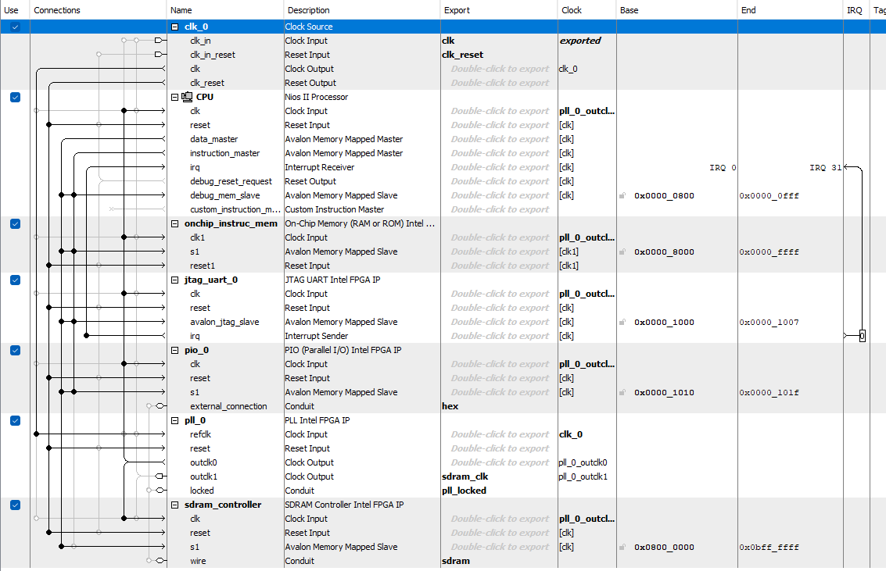
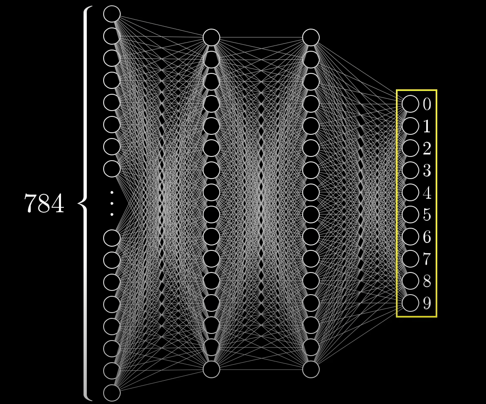

# Deep Neural Network Accelerator on an FPGA

## Contents
- [Objectives](#objectives)
- [Creating a Nios II System](#creating-a-nios-ii-system)
- [Model Training](#model-training)
- [Outputs](#outputs)
- [Next Steps](#next-steps)

## Objectives
- Train a neural network to identify numbers from the MNIST dataset
- Use the weights and biases that were accurately generated to run the model on the softcore of the FPGA
- Create a module that accelerates the calculation of the dotproduct needed for forward propogation
- Calculate the speedup of using the FPGA
## Creating a NIOS II System

### **What the deep neural network accelerator system consists of:**
- Nios II CPU
- 32KB on-chip **instruction memory**
- JTAG UART + debug memory slave
- **SDRAM controller**
- 7-bit output **PIO** exported as `hex`
- Phase Locked Loop (PLL) that synchronizes an output signal's frequency and phase with a reference input signal
    - `outclk0`: 50 MHz, 0 ps drives CPU and most modules
    - `outclk1`: 50 MHz, **-3000 ps** drives SDRAM clock (`sdram_clk`) to compensate board routing delay

## Model Training

Training is done **offline in Python** (supervised learning). After convergence, the script **exports the learned weights/biases** into a single file that the Nios II program expects. This allows us to run the forward propogation on the FPGA without needing to adjust the weights of the neural network. The MLP consists of the 784 pixel input, two 16 neuron layers and one 10 neuron output layer.

  
*image from [3blue1brown](https://www.3blue1brown.com/?v=neural-networks) and this is the exact neural network we trained*

**Outputs:**
- `trained_dnn.npz` to store multiple NumPy arrays in a single, compressed archive
- `weights_biases` contains all the weights and biases of all the layers of the neural network.
- `nn_rom_q14.hex` contains the weights and biases in [Q2.14](https://en.wikipedia.org/wiki/Q_(number_format)) format in case I choose to use ROM.

## Next

    - Make sure memory is readable off sdram or ROM
    - Create a memory accelerator module if needed
    - Create a dot product accelerator module

