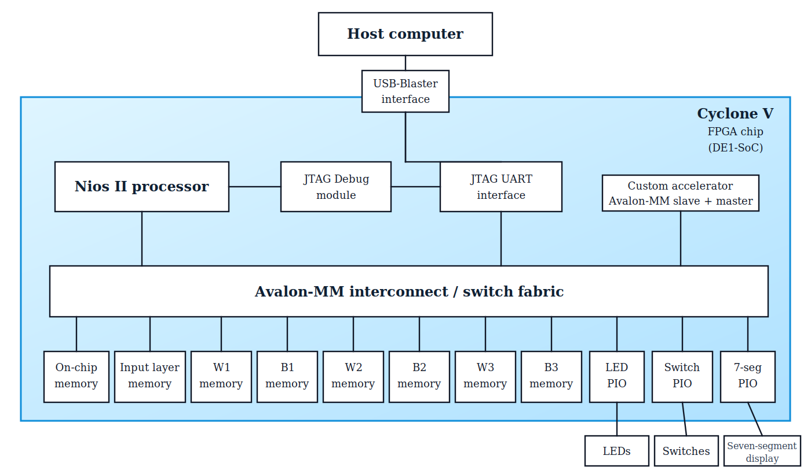

# Deep Neural Network Accelerator on an FPGA

A hardware/software neural-network inference project for the DE1-SoC board. The model is trained offline in Python, converted to signed Q8.8 fixed-point, and then run on a Nios II based FPGA system with a custom Avalon-MM accelerator for dense-layer computation.

## Project Details

| Area | Details |
| --- | --- |
| Platform | Cyclone V FPGA on the DE1-SoC board |
| Processor | Nios II soft processor |
| Accelerator | Custom SystemVerilog Avalon-MM slave/master module |
| Network | MNIST MLP: `784 -> 16 -> 16 -> 10` |
| Number format | Signed Q8.8 fixed-point |
| Accuracy | `95.27%` on 10000 MNIST test images |
| Main result | Fixed-point accelerator path is only `0.04` percentage points below the floating-point validation accuracy |

## Contents
- [Objectives](#objectives)
- [Key Files](#key-files)
- [System Architecture](#system-architecture)
- [Model Training](#model-training)
- [Fixed-Point Inference Math](#fixed-point-inference-math)
- [Accelerator Accuracy](#accelerator-accuracy)
- [Accelerator FSM](#accelerator-fsm)
- [Weight and Bias Memory Initialization](#weight-and-bias-memory-initialization)
- [Verification](#verification)
- [Challenges and Lessons Learned](#challenges-and-lessons-learned)

## Objectives
- Train a compact neural network that can classify handwritten MNIST digits.
- Convert the trained floating-point weights and biases into signed Q8.8 fixed-point values for FPGA memory.
- Build a custom hardware accelerator for the dense-layer multiply-accumulate work used during forward propagation.
- Integrate the accelerator into a Nios II system as a memory-mapped Avalon-MM peripheral.
- Validate that the FPGA-oriented fixed-point datapath keeps high classification accuracy.

## Key Files

| Path | Purpose |
| --- | --- |
| [`accelerator.sv`](./accelerator.sv) | Custom accelerator RTL and FSM |
| [`System_Accelerated/acc.sv`](./System_Accelerated/acc.sv) | Accelerator source used inside the accelerated Quartus system |
| [`software/Accelerated_Inference/hello_world_small.c`](./software/Accelerated_Inference/hello_world_small.c) | Nios II software that configures and runs the accelerator |
| [`training/training_dnn.py`](./training/training_dnn.py) | Python training script for the MNIST MLP |
| [`training/convert_data_q88.py`](./training/convert_data_q88.py) | Converts trained parameters into signed Q8.8 `.mif` files |
| [`weights_biases/`](./weights_biases) | FPGA memory initialization files for weights and biases |
| [`testing/verify_inference.py`](./testing/verify_inference.py) | Fixed-point software reference for checking inference outputs |
| [`testing/acc_fsm_tb.sv`](./testing/acc_fsm_tb.sv) | ModelSim FSM testbench for the accelerator |

## System Architecture

This project is built as a small system-on-chip on the Cyclone V FPGA in the DE1-SoC board. The Nios II processor controls the inference flow in software, while the custom accelerator performs the repeated dense-layer multiply-accumulate work in hardware.

<p align="center">

</p>

The design is connected through an Avalon-MM interconnect, which lets the Nios II processor, memory blocks, PIO peripherals, JTAG UART, and custom accelerator share one memory-mapped system.

| Component | Role in the system |
| --- | --- |
| Host computer | Programs the board and communicates through the USB-Blaster/JTAG path |
| Nios II processor | Runs the inference software and configures the accelerator for each layer |
| Custom accelerator | Reads inputs/weights/biases, computes dense-layer outputs, and writes activations back to memory |
| On-chip memories | Store the input image, weights, biases, hidden activations, and final logits |
| JTAG UART | Provides debug/console communication with the host computer |
| PIO blocks | Connect the design to LEDs, switches, and the seven-segment display |

The accelerator is both an Avalon-MM slave and master. The CPU writes control registers through the slave interface, while the accelerator uses its master interface to read and write the memory blocks directly. This is the main hardware/software co-design point in the project: software decides *which layer* to run, and hardware performs the heavy dot-product work.

At a high level, software starts one layer at a time. For each layer, it writes the input base address, weight base address, bias/output base address, layer sizes, and ReLU setting into the accelerator. The hardware then walks through memory, computes every output neuron, writes the result back to memory, and raises `done` for the processor.

## Model Training

Supervised learning is done **offline in Python**. This lets the FPGA focus only on inference, while training and weight updates happen on the computer first.

The trained Multilayer Perceptron (MLP) has:
- an input layer of 784 pixels
- a first hidden layer of 16 neurons with ReLU
- a second hidden layer of 16 neurons with ReLU
- an output layer of 10 logits, one for each digit from 0 to 9

The output layer does **not** apply ReLU. The predicted digit is the index of the largest output value.


*Image from [3blue1brown](https://www.3blue1brown.com/?v=neural-networks). This is the same network shape used in this project.*

## Fixed-Point Inference Math

For an input image `x` with 784 normalized pixel values, the network computes:

```text
h1 = ReLU(W1 x + b1)      W1: 16 x 784, b1: 16
```
```text
h2 = ReLU(W2 h1 + b2)     W2: 16 x 16,  b2: 16
```
```text
z  = W3 h2 + b3           W3: 10 x 16,  b3: 10
```
```text
prediction = argmax(z)
```

For one neuron, the accelerator computes the same dense-layer equation repeatedly:

```text
a_i = b_i + sum(x_j * w_i,j)   for j = 0 to N - 1
```

Then:
- hidden layers apply `ReLU(a_i) = max(0, a_i)`
- the output layer leaves the value unchanged and treats it as a logit


### Q8.8 Fixed-Point Format

The FPGA stores weights, biases, inputs, and activations as **signed Q8.8 fixed-point** values:

```text
fixed_value = round(real_value * 2^8)
real_value  ~= fixed_value / 256
```

This gives:
- 16-bit storage per value
- 8 fractional bits of precision
- a range of about `-128.0` to `+127.996`
- simple integer multiply-accumulate hardware

### Hardware Multiply-Accumulate Flow

The accelerator works on one output neuron at a time.

1. Start the accumulator with the bias:

```text
acc = bias << 8
```

The bias is Q8.8, so shifting left by 8 converts it into Q16.16.

2. Accumulate every input-weight product:

```text
acc = acc + (x * w)
```

Since `x` and `w` are both Q8.8, their product is Q16.16, which matches the accumulator scale.

3. Round back to Q8.8:

```text
if acc >= 0:
    out = (acc + 128) >> 8
else:
    out = -(((-acc) + 128) >> 8)
```

4. Optionally apply ReLU:

```text
if relu_enable and out < 0:
    out = 0
```

5. Saturate to the signed 16-bit Q8.8 range:

```text
out = clamp(out, -32768, 32767)
```

The software runs the accelerator once per layer. After each run, the new activations are written back into memory and reused as the next layer's input.

## Accelerator Accuracy

Using the exported Q8.8 weights and biases together with the same fixed-point layer math used by the accelerator, the design correctly classified **9527 out of 10000** MNIST test images.

| Datapath | Accuracy |
| --- | --- |
| Floating-point trained model validation accuracy | `95.31%` |
| Q8.8 fixed-point accelerator path | `95.27%` |
| Accuracy drop after fixed-point conversion | `0.04` percentage points |

That result is the most important validation point: the hardware-friendly Q8.8 implementation preserves almost all of the trained model's accuracy.

## Accelerator FSM

The custom accelerator is controlled by a finite-state machine in [`accelerator.sv`](./accelerator.sv). Each accelerator run computes **one full dense layer**. Software provides:

- `start`
- `input_base`
- `weights_base`
- `bias_base`
- `input_size`
- `output_size`
- `relu_enable`

The FSM then walks through the input vector, weight matrix, and bias vector to produce every output neuron.

### Every State and What It Does

| Phase | State | What it does |
| --- | --- | --- |
| Setup | `idle_st` | Waits for `start = 1`. While idle, it clears counters, accumulator registers, and Avalon master control signals. |
| Outer loop | `outer_loop_st` | Checks whether all output neurons are complete. If not, starts a memory read for the current neuron's bias. |
| Bias read | `read_1_st` | Waits for the bias read, extracts the correct 16-bit halfword, sign-extends it, and initializes `accumulation = bias << 8`. |
| Inner loop | `inner_loop_st` | Checks whether all inputs for the current neuron have been processed. If not, starts the next input read. |
| Input read | `read_2_st` | Captures the input value `x` and starts the matching weight read. |
| Weight read | `read_3_st` | Captures the weight value `w` and moves to the arithmetic state. |
| MAC | `dot_st` | Performs `accumulation <= accumulation + x * w`, increments `input_j`, and loops back for the next input. |
| Post-processing | `done_inn_st` | Rounds the Q16.16 accumulator back to Q8.8 and optionally applies ReLU. |
| Post-processing | `saturate_st` | Saturates the result into `[-32768, 32767]` and prepares the writeback address. |
| Writeback | `write_st` | Packs the 16-bit activation into the correct half of the 32-bit Avalon write bus. |
| Writeback | `write_wait_st` | Waits for the memory write to complete, then advances to the next neuron. |
| Done | `done_out_st` | Indicates that the full layer is complete. |
| Done | `wait_start_st` | Waits for software to lower `start` back to `0` before returning to idle. |

### FSM Flow

<p align="center">

</p>

### Why the FSM Is Structured This Way

- The accelerator reuses one multiply-accumulate datapath instead of building many multipliers in parallel.
- Bias, input, and weight values are streamed from memory only when needed.
- The same FSM works for all three network layers because software changes only the base addresses, sizes, and `relu_enable` flag.
- Hidden layers run with ReLU enabled, and the final output layer runs with ReLU disabled.

## Weight and Bias Memory Initialization

After training, the learned weights and biases are stored as 32-bit floating-point values. Before loading them into FPGA memory, they are converted into **signed Q8.8 fixed-point** and written into `.mif` files.


This format is useful for the FPGA because it gives:
- enough precision and dynamic range for this network
- compact 16-bit memory storage
- simple integer arithmetic
- easier initialization of Quartus on-chip memories

### Conversion Flow


The memory layout is layer-specific:

| Memory | Contents |
| --- | --- |
| `input_layer` | 784 Q8.8 input pixels |
| `w1`, `w2`, `w3` | Q8.8 weight matrices |
| `b1`, `b2`, `b3` | Initial biases, then layer outputs after each accelerator run |

The bias memories are intentionally reused as output buffers. For example, layer 1 reads from `B1` as the bias vector and then writes the hidden-layer activation values back into `B1`, so layer 2 can use `B1` as its input.

## Verification

The project was checked at multiple levels:

| Check | What it validates |
| --- | --- |
| Python fixed-point inference | Confirms that Q8.8 arithmetic matches the intended neural-network math |
| MNIST test-set accuracy | Confirms the full fixed-point inference path reaches `95.27%` accuracy |
| Nios II inference code | Confirms software can configure the accelerator one layer at a time |
| ModelSim FSM testbench | Exercises the accelerator FSM, including ReLU, saturation, writeback, and `done` behavior |

The FSM testbench generates a waveform file for debugging the accelerator control flow:

```text
testing/acc_fsm_tb.vcd
```

## Challenges

- **Choosing the fixed-point format:** The first Q2.14 representation did not provide enough range for hidden-layer activations, so many values clipped and accuracy dropped to around 45%. Moving to Q8.8 gave the model enough dynamic range while still keeping 16-bit storage.
- **Memory file format mismatch:** The generated `.hex` files were initially byte-addressed Intel HEX files, but the Quartus memories were configured as 16-bit word-addressed memories. Switching to the correct `.mif` layout fixed corrupted memory contents.
- **Software/hardware debugging:** Python verification and Nios II inference originally produced different logits for the same image. That forced the debugging to include both the neural-network math and the way fixed-point data was loaded into FPGA memory.
- **Bias memory reuse:** The accelerator writes each layer output back into that layer's bias memory. This saves extra memory blocks, but it also means repeated inference needs the memories to be reloaded or carefully managed.
- **Sequential MAC design:** The accelerator uses one multiply-accumulate datapath and iterates through the inputs. This keeps the hardware simple and reusable across layers, but it leaves room for future speedups through parallel MAC lanes or deeper pipelining.
